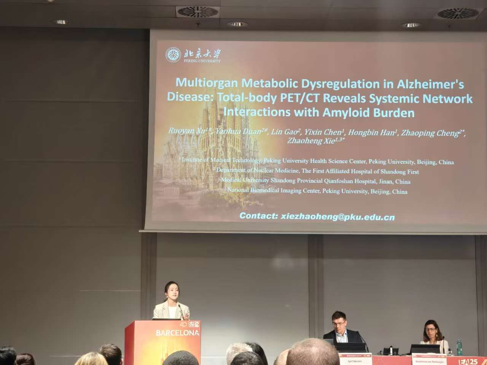
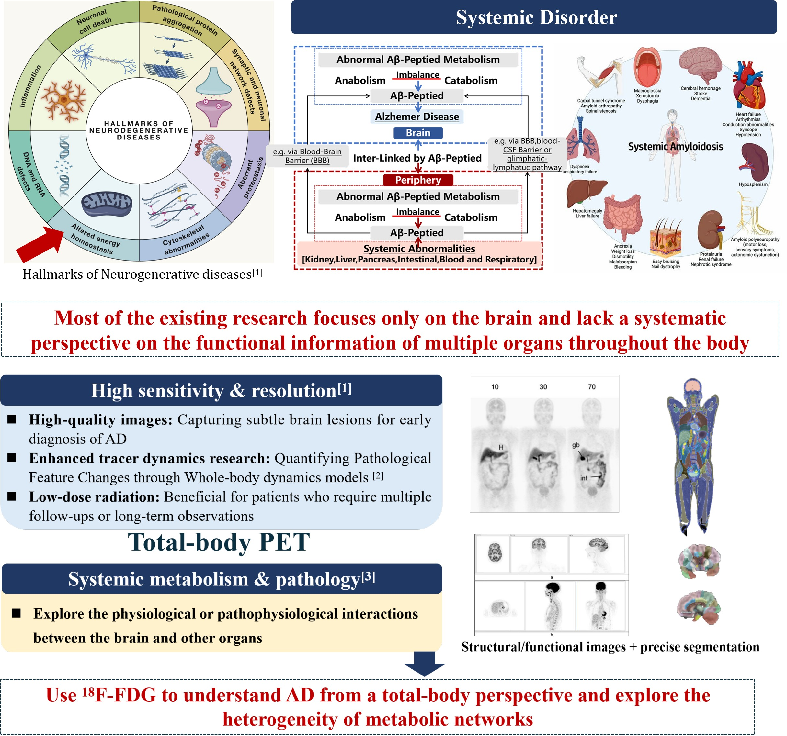
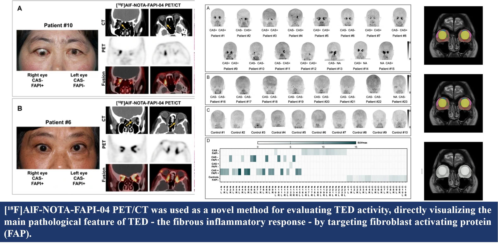

My research focuses on developing **AI-driven multimodal medical imaging methods**
to investigate disease mechanisms and support precision diagnosis, with a particular
emphasis on **nuclear medicine**, **total-body PET/CT**, and **neurodegenerative diseases**.

---

## Highlighted Research

### Top Rated Oral Presentation at EANM 2025

**Multiorgan Metabolic Dysregulation in Alzheimer’s Disease:  
Total-body PET/CT Reveals Systemic Network Interactions with Amyloid Burden**

This study was accepted as a **Top Rated Oral Presentation (TROP)** and featured in
the **EANM Neuroimaging Committee: Innovations and Methodologies in Nuclear
Neuroimaging** session at the Annual Congress of the European Association of Nuclear
Medicine (EANM 2025).

The work leverages **total-body PET/CT** to characterize systemic metabolic network
interactions associated with amyloid burden in Alzheimer’s disease, highlighting
methodological advances in whole-body neuroimaging beyond brain-centric analyses.

---

## Multimodal Neuroimaging for Alzheimer’s Disease

I study systemic and brain-specific metabolic alterations in Alzheimer’s disease
using **total-body PET/CT**, integrating whole-body FDG and amyloid PET imaging with
network-based and machine learning approaches. This research aims to move beyond
brain-only analyses by characterizing **multi-organ metabolic network interactions**
and their associations with amyloid burden and cognitive decline.

Current topics include:
- Construction of whole-body and brain metabolic networks from total-body PET/CT
- Integration of FDG and amyloid PET for multilayer network analysis
- AI-based modeling of disease-related network disruption and progression

---

## AI-driven Multimodal Imaging for Graves’ Ophthalmopathy

I am also involved in developing a **precision assessment and staging framework**
for Graves’ ophthalmopathy based on **[¹⁸F]AlF-NOTA-FAPI-04 PET/CT** and deep
learning–based multimodal image fusion. By combining functional PET information
with anatomical imaging and data-driven models, this work aims to improve
quantitative evaluation, disease stratification, and clinical decision-making
in orbital disease.

Current topics include:
- Quantitative analysis of FAPI uptake in orbital tissues
- Deep learning–based multimodal fusion of PET and CT/MR imaging
- Automated disease staging and phenotype classification

---

## Methodological Interests

Across these applications, I am broadly interested in methodological advances
in **medical image analysis and artificial intelligence**, including:
- Multimodal image registration and fusion
- Graph-based modeling of metabolic and functional networks
- Interpretable machine learning for clinical imaging applications
